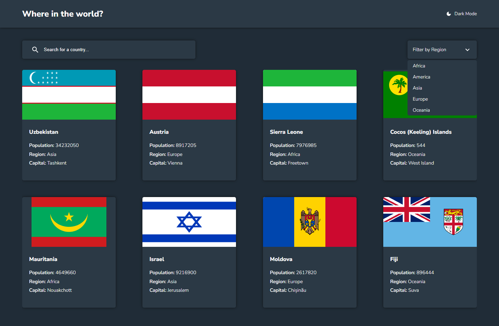
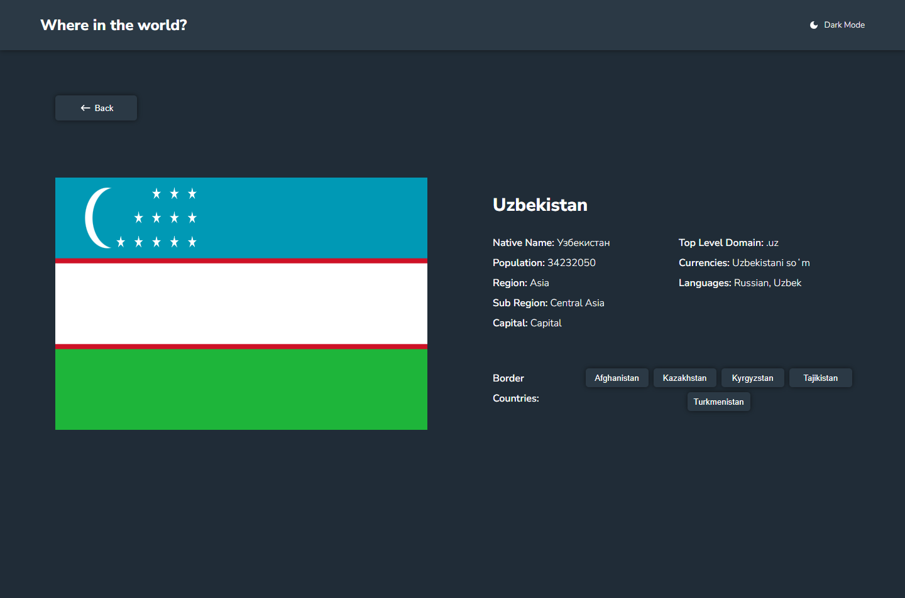
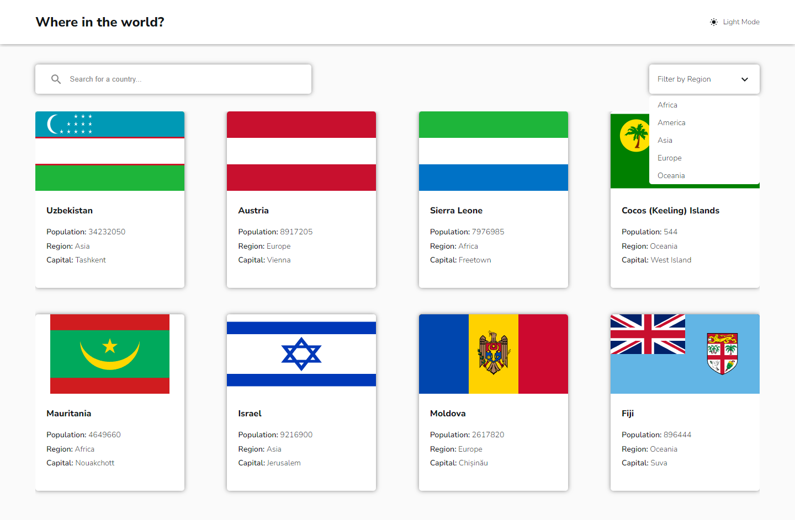
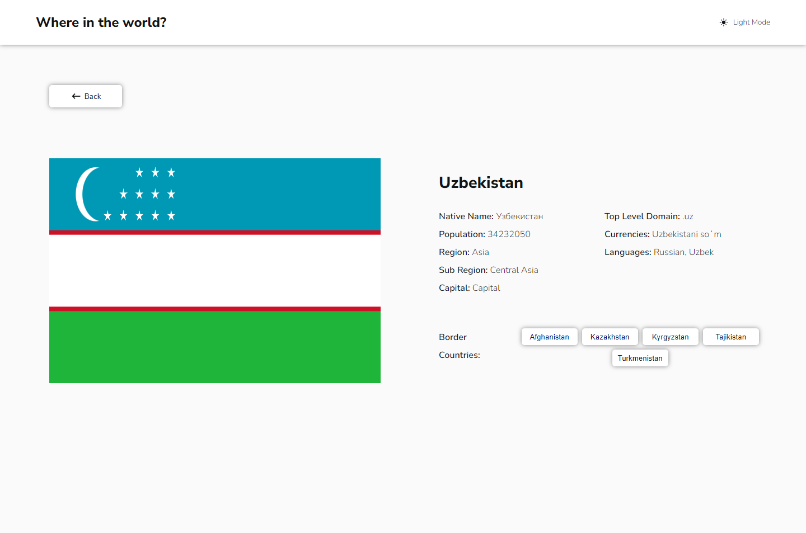
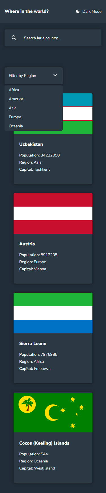
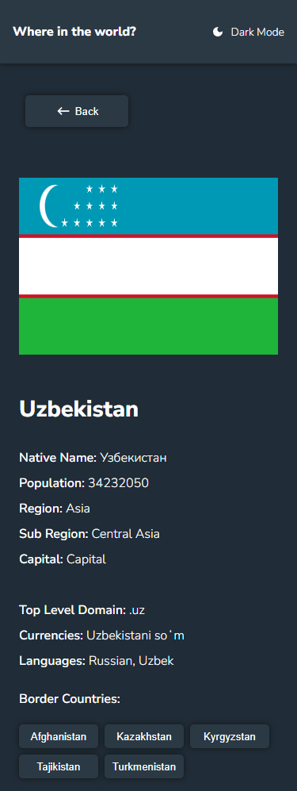
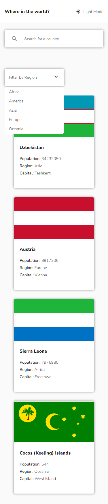
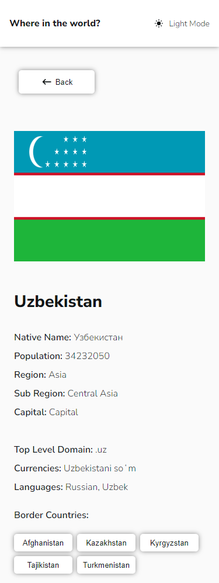

# Frontend Mentor - REST Countries API with color theme switcher solution

This is a solution to the [REST Countries API with color theme switcher challenge on Frontend Mentor](https://www.frontendmentor.io/challenges/rest-countries-api-with-color-theme-switcher-5cacc469fec04111f7b848ca).

## Table of contents

- [Overview](#overview)
  - [Screenshot](#screenshot)
  - [Links](#links)
- [My process](#my-process)
  - [Built with](#built-with)
  - [What I learned](#what-i-learned)
  - [Continued development](#continued-development)
  - [Useful resources](#useful-resources)
- [Author](#author)

## Overview

### Screenshot

#### Desktop View

- Dark Mode
  
  
- Light Mode
  
  

#### Mobile View

- Dark Mode
  
  
- Light Mode
  
  

### Links

- Solution URL: [Repo](https://github.com/WanderFeliz/res-countries-api)
- Live Site URL: [Demo](https://your-live-site-url.com)

## My process

### Built with

- Semantic HTML5 markup
- Flexbox
- [React](https://reactjs.org/) - JS library
- [TypeScript](https://www.typescriptlang.org/) - For types
- [Next.js](https://nextjs.org/) - React framework
- [Sass](https://sass-lang.com/) - For styles

### What I learned

Here I learned how to use in more detail the library Tanstack Query.

### Continued development

Something i want to keep improving is the use of TypeScript and Context Managers.

### Useful resources

- [Tanstack Query Docs](https://tanstack.com/query/v5/docs/react/overview) - This helped me in the use of react-query. Also going into the community is something i will recommend because there are some things that are explained in more detail.

## Author

- Website - [Wander Paniagua](https://wanderfeliz.github.io/me)
- Frontend Mentor - [@WanderFeliz](https://www.frontendmentor.io/profile/WanderFeliz)
